<div align="center">


# Stardrop Logs

**A cozy pixel-art gut-health diary.**
Log your bowel movements in a few taps, grow a little garden, and let Mia cheer you on.

### [Try the live app: stardrop-five.vercel.app](https://stardrop-five.vercel.app/)

Next.js · Supabase · Tailwind CSS · GSAP · Lenis

</div>

---

## Screenshots

<table>
  <tr>
    <td align="center">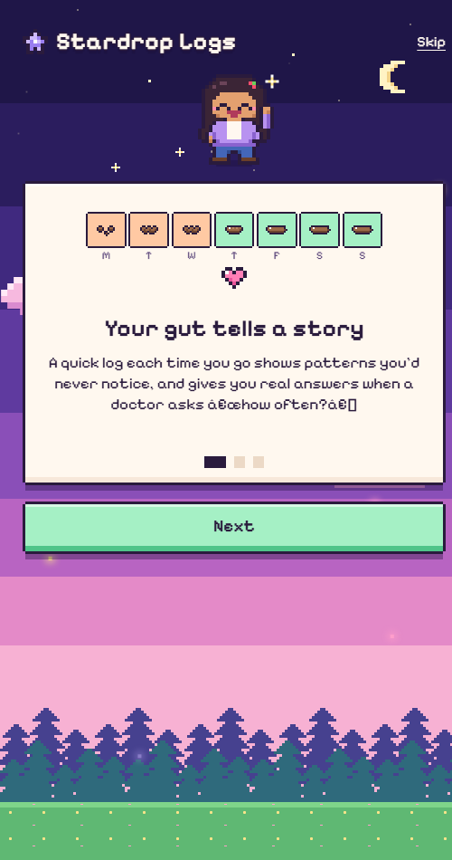<br /><b>Why track? (3 slides)</b></td>
    <td align="center">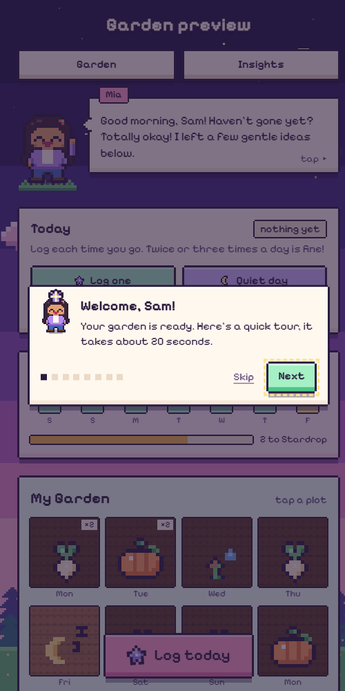<br /><b>Mia's first-visit tour</b></td>
    <td align="center">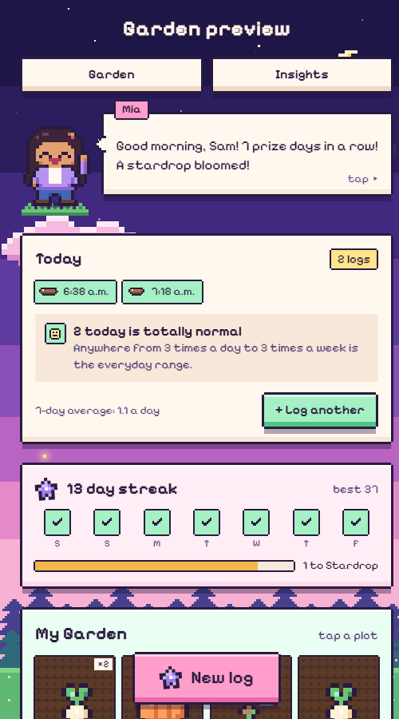<br /><b>Today: is this normal?</b></td>
  </tr>
  <tr>
    <td align="center">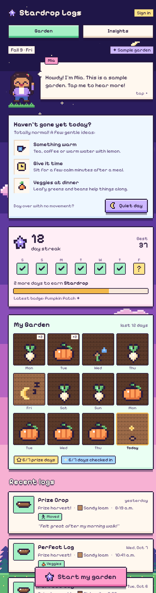<br /><b>Garden</b></td>
    <td align="center">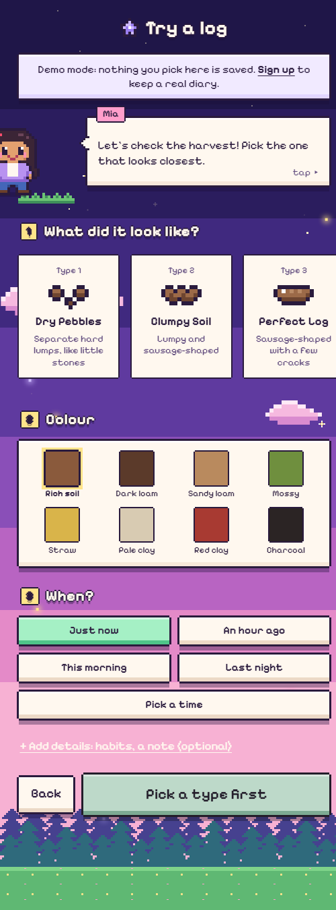<br /><b>Try a log (no account)</b></td>
    <td align="center">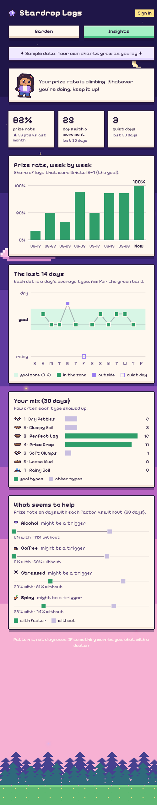<br /><b>Insights</b></td>
  </tr>
  <tr>
    <td align="center">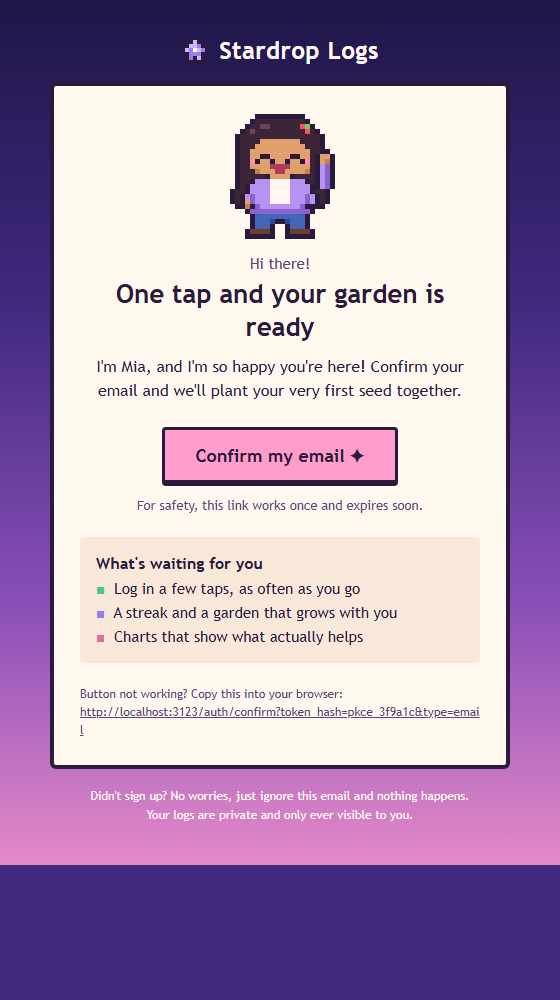<br /><b>Confirmation email</b></td>
    <td align="center">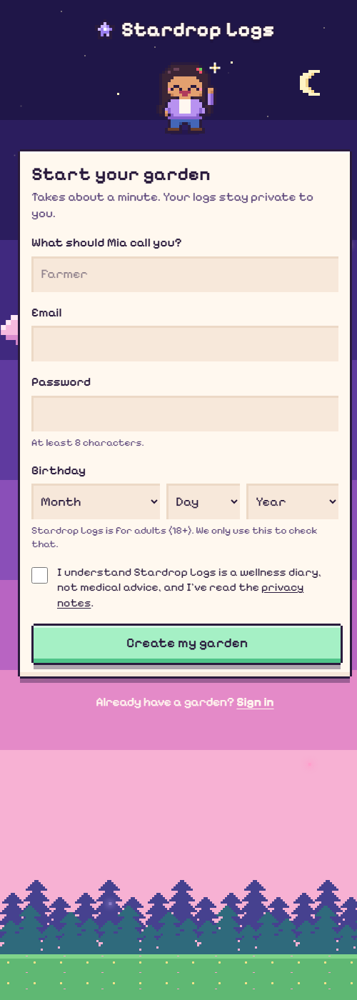<br /><b>Sign up (18+)</b></td>
    <td align="center">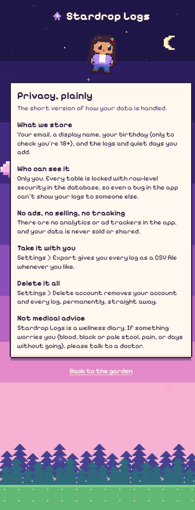<br /><b>Privacy, plainly</b></td>
  </tr>
</table>

## What it does

| | |
|---|---|
| **Quick logging** | Swipe through the 7 [Bristol stool types](https://en.wikipedia.org/wiki/Bristol_stool_scale) (renamed things like *Dry Pebbles*, *Prize Crop* and *Rainy Soil*), tap a colour, pick when. Habits and a note are tucked under *Add details*. |
| **As many logs as you need** | Log every time you go. The **Today** card lists each one with its time and says whether that's normal: up to 3 a day is the everyday range, 4+ or several loose ones get a gentle heads-up, and lots of watery ones suggest a doctor. |
| **Friendly start** | Three short slides on why tracking helps, then a 20-second guided tour of the garden on your first visit (replay it from Settings). |
| **Mia** | A chibi pixel companion who waves, blinks, toddles around and reacts to what you pick with friendly tips. She says *Hey Queen!*, *Hey Buddy!* or *Hey there!* depending on the gender picked at sign-up (changeable in Settings). Tap her for more. |
| **The garden** | Each of the last 12 days is a plot. Healthy days grow parsnips, a 3-day streak grows pumpkins, and 7 days in a row blooms a stardrop flower. |
| **Streaks & badges** | A check-in streak (a log *or* a "quiet day" counts), this week at a glance, and badges from *Sprout* (3 days) up to *Valley Hero* (100). |
| **Quiet days** | Didn't go today? Tap **Quiet day** to record it and keep your streak. You also get a few gentle ideas, and after 3+ days Mia suggests talking to a pharmacist or doctor. |
| **Insights** | Prize rate (share of type 3-4 logs) week by week, your average per day, and which habits seem to help. The daily trend and Bristol mix sit under *More charts*. |
| **Your data, your call** | Export everything as CSV, or delete your account and every log in one go. |
| **Try before signing up** | Visitors can look around a sample garden and try the log screen at `/try`. Their pick blooms in the sample garden, but **nothing is saved or sent**. Saving logs, history, charts and export all need an account, which is where the 18+ check and privacy agreement happen. Insights shows a blurred preview until then. |

| **Cute emails** | On-brand confirm-signup and reset-password emails with Mia ([`supabase/templates`](supabase/templates)). |

> [!IMPORTANT]
> **Stardrop Logs is not a medical app.** It's a wellness diary for keeping notes. It doesn't diagnose, treat or give medical advice, and it never replaces a doctor. Anything unusual (blood, black or pale stool, ongoing pain, days without going, diarrhea for more than 2 days) is pointed to a real doctor, and the full disclaimer lives at `/disclaimer`, linked from every screen and agreed to at sign-up. In an emergency, call your local emergency number.

## How it works

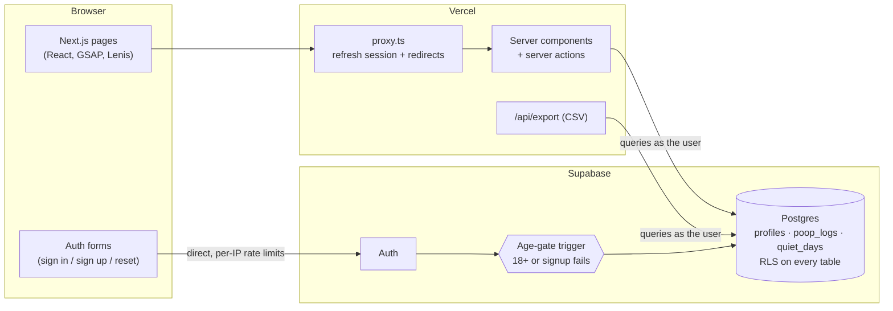

- Every query runs **as the signed-in user**. Postgres row-level security decides what comes back; the app never uses a service-role key.
- Garden days, streaks and charts are worked out in the browser in **your** timezone, so a log at 11pm lands on the right day.
- Mia, the crops and every icon are **drawn in code** from text grids (`src/lib/mia/chibi.ts`, `src/lib/crops.ts`), so there are no sprite sheets to load.

### Data model

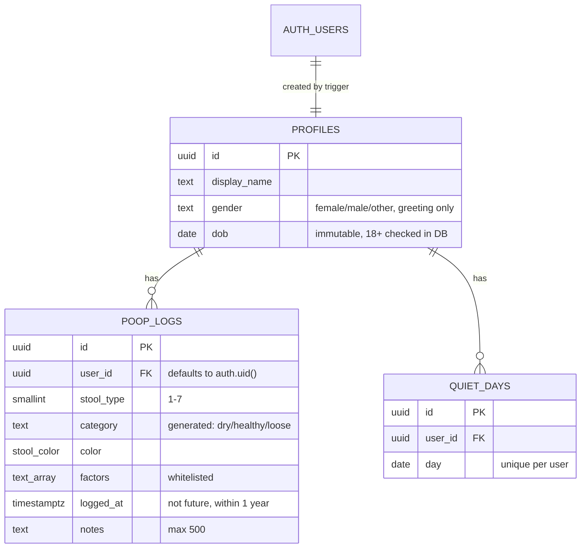

## Security

- **Row-level security, enabled and forced, on every table.** Users can only read, write or delete their own rows. Logged-out visitors have no table access at all.
- **Column-level grants.** Clients can't write `user_id`, `dob`, `category` or timestamps, so nobody can log on someone else's behalf or change their birthday later.
- **18+ age gate in the database.** A trigger on `auth.users` rejects sign-ups without a valid birthdate or under 18, so going around the UI doesn't help. The UI checks too, for a friendly message.
- **Validation twice.** Zod schemas on the server and matching `CHECK` constraints and triggers in Postgres (types 1-7, whitelisted colours and factors, note length, time window, 50 logs/day cap).
- **Verified sessions.** The server uses `getClaims()`, which verifies the JWT, instead of trusting the cookie.
- **Auth from the browser.** Sign-in, sign-up and reset requests go straight to Supabase so its per-IP rate limits work for each real user. Error messages never reveal whether an email has an account.
- **No open redirects.** Every `?next=` is checked to be a local path.
- **Strict headers.** CSP (only this site and your Supabase project), HSTS, `X-Frame-Options: DENY`, `nosniff`, a locked-down Permissions-Policy, COOP/CORP, and no `X-Powered-By`.
- **Safe exports.** CSV cells that start with `= + - @` are neutralized so a note can't turn into a spreadsheet formula. Responses are `no-store`.
- **`server-only` modules** so server code can't end up in the browser bundle, and **no secrets in the client**. Only the publishable key is public, and RLS is what protects the data.
- **Proven, not assumed.** `supabase/tests/*.sql` impersonate two users and an anonymous visitor and assert that nothing leaks.
- **Safe emails.** The templates never include text from the sign-up request (like the name), so nobody can use sign-up to send their own words to someone else's inbox.
- **Open-source hygiene.** No secrets anywhere in the repo or its history, CI runs with a read-only token and actions pinned to exact commits, Dependabot watches dependencies, and [SECURITY.md](SECURITY.md) explains how to report a problem privately.

`npm audit --omit=dev` reports **0 vulnerabilities** in shipped code. (`npm audit` flags `braces` inside Next's ESLint config. There's no patched release yet, and it only runs on your machine at lint time.)

## Getting started

You'll need **Node 20+** (24 recommended) and a free [Supabase](https://supabase.com) project.

```bash
git clone https://github.com/<you>/stardrop-logs.git
cd stardrop-logs
npm install
cp .env.example .env.local     # then fill in your two Supabase values
```

### 1. Set up the database

In the Supabase dashboard open **SQL Editor** and run these in order:

1. `supabase/migrations/0001_init.sql`
2. `supabase/migrations/0002_quiet_days.sql`
3. `supabase/migrations/0003_gender.sql`

Optional but recommended: run the three files in `supabase/tests/`. They roll themselves back and should finish with `ALL RLS CHECKS PASSED`, `QUIET DAY CHECKS PASSED` and `GENDER CHECKS PASSED`.

Then check everything from your terminal:

```bash
npm run check:supabase
```

### 2. Configure Supabase Auth

In **Authentication**:

- **Sign In / Providers**: keep **Email** on and **Confirm email** on. Leave social logins off; they don't send a birthday, so the age gate would turn them away.
- **Passwords**: minimum length **8**. If your plan has it, turn on **leaked password protection**.
- **URL Configuration**:
  - Site URL: `http://localhost:3000` for now (your real domain later).
  - Redirect URLs: add `http://localhost:3000/**` and later `https://your-domain/**`.
- **Email Templates**: paste in the cute ones from [`supabase/templates`](supabase/templates) (steps in its README). Their links go through `/auth/confirm`, so they work even when opened on another device. The default templates also work, through `/auth/callback`, as long as the link is opened in the same browser.
- **SMTP**: Supabase's built-in mailer is only for testing. Add your own provider before launch.

### 3. Run it

```bash
npm run dev        # http://localhost:3000
```

During development there are two extra pages: `/dev/mia` (all of Mia's animations and the pixel art), `/dev/garden` (a signed-in garden with sample data; try `?today=4`, `?tour=1` or `?gender=male`). Both 404 in production.

## Deploying to Vercel

1. Push this repo to GitHub.
2. In Vercel, **Add New > Project** and import the repo. The defaults are right (framework Next.js, `npm run build`).
3. Add the environment variables for **Production** and **Preview**:
   - `NEXT_PUBLIC_SUPABASE_URL`
   - `NEXT_PUBLIC_SUPABASE_PUBLISHABLE_KEY`
4. Deploy.
5. Back in Supabase, set **Site URL** to your Vercel domain and add `https://your-domain/**` to **Redirect URLs**.

Or from the terminal:

```bash
npm i -g vercel
vercel link
vercel env add NEXT_PUBLIC_SUPABASE_URL
vercel env add NEXT_PUBLIC_SUPABASE_PUBLISHABLE_KEY
vercel            # preview deploy
vercel --prod     # production
```

Before going live it's worth running through **sign up > confirm email > log > quiet day > export > delete account** on the preview URL.

## Scripts

| Command | What it does |
|---|---|
| `npm run dev` | Dev server |
| `npm run build` / `npm start` | Production build / serve it |
| `npm run lint` | ESLint (includes the React Compiler rules) |
| `npm run typecheck` | TypeScript, no emit |
| `npm test` | Unit tests (Vitest): validation, age gate, redirects, CSV safety, streaks, daily rhythm, greetings, insights, pattern model |
| `npm run check:supabase` | Checks your Supabase project is connected and all three migrations ran |
| `npm run art` | Redraws Mia's email images, tab icon and home-screen icon |

## Project structure

```
src/
  app/
    (farm)/             Garden (/) and Insights, sharing the header + tabs
    log/                The log screen (signed in only)
    try/                The same screen as a demo for visitors (saves nothing)
    welcome, signup, login, forgot, reset, check-email, age-restricted, privacy, settings
    auth/               Email link handlers (/auth/confirm, /auth/callback) + error page
    api/export/         CSV download
    actions/            Server actions (logs, quiet days, account)
  components/
    dashboard/          Mia's corner, today card, streak card, garden, timeline
    insights/           The four charts + shared chart bits
    log/                The log creator
    tour/               The first-visit guided tour
    mia/                MiaSprite (animation)
    scene/              The dusk sky backdrop
    ui, forms, auth, settings, nav, fx
  lib/
    mia/                Chibi Mia pixel frames + animation states
    farm.ts             Garden + streak logic
    rhythm.ts           "Is this normal?" for logs per day
    insights.ts         Chart data
    model/              Placeholder for a future personalised model (unused)
    validation.ts       Zod schemas, age check, safe redirects
    supabase/           Server + browser clients
  proxy.ts              Session refresh + quick redirects
supabase/
  migrations/           SQL to run, in order
  templates/            Auth email templates
  tests/                RLS checks you can run in the SQL editor
public/email/           Mia's images for the emails
.github/                CI + Dependabot
```

## What's next

The plan is to eventually learn each person's own rhythm with a small personalised model. There's a placeholder for it in `src/lib/model` (a simple statistics baseline behind a swappable interface) that the app doesn't use yet. [docs/MODEL.md](docs/MODEL.md) covers the plan and the privacy rules it has to follow, starting with opt-in only.

## License

No license has been chosen yet, so the code is "all rights reserved" by default. Add a `LICENSE` file if you'd like others to reuse it.
